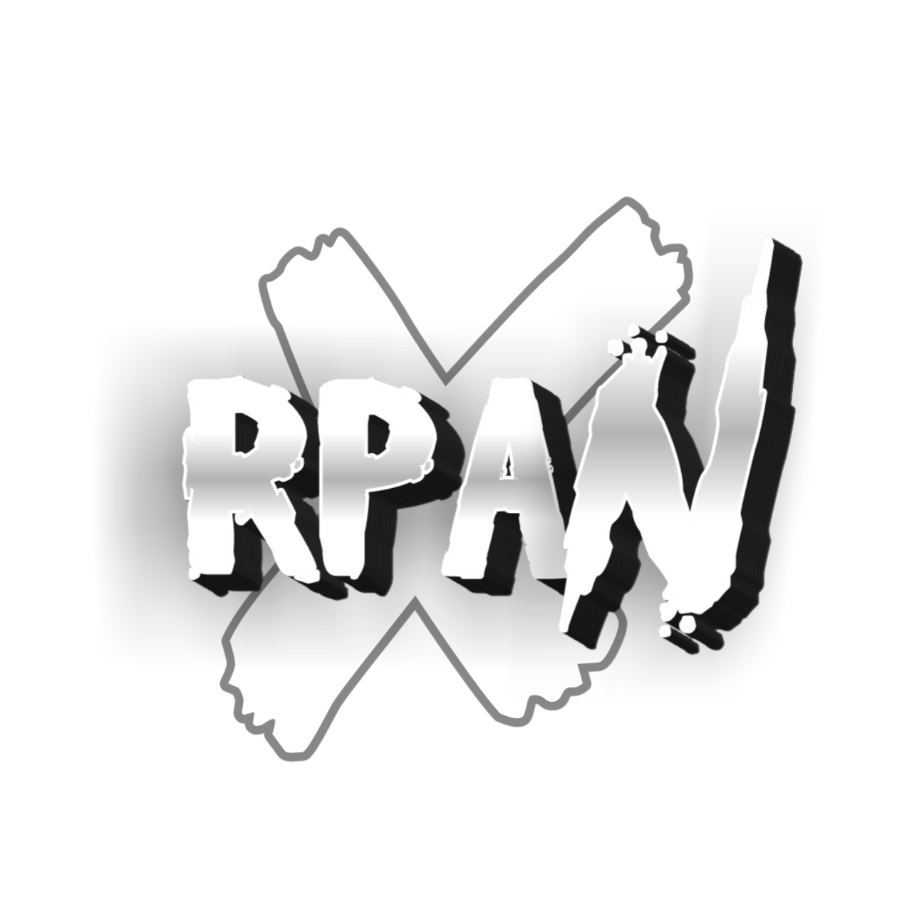

<h1 align="center">RPAN PROJECTS</h1>

[](https://github.com/kuinginngopi/Rpan-Userbot)
[](https://GitHub.com/kuinginngopi/Rpan-Userbot/graphs/commit-activity)
[](https://www.codefactor.io/repository/github/kuinginngopi/Rpan-Userbot)
[](https://app.codacy.com/gh/kuinginngopi/Rpan-Userbot/dashboard)
[](https://hub.docker.com/r/kuinginngopi/Rpan-userbot/tags)
[](https://github.com/kuinginngopi/Rpan-Userbot/fork)
[](https://github.com/kuinginngopi/Rpan-Userbot/stargazers)

Rpan-Userbot adalah userbot Telegram modular yang berjalan di Python3 dengan database sqlalchemy.

Berbasis [Paperplane](https://github.com/RaphielGang/Telegram-UserBot) dan [ProjectBish](https://github.com/adekmaulana/ProjectBish) userbot.
Saya membuat repository ini untuk memilih dan menambahkan beberapa modul yang saya butuhkan dengan banyak perubahan, fitur dan modul.

## Disclaimer

```
Saya tidak bertanggung jawab atas penyalahgunaan bot ini.
Bot ini dimaksudkan untuk bersenang-senang sekaligus membantu anda
mengelola grup secara efisien dan mengotomatiskan beberapa hal yang membosankan.
Gunakan bot ini dengan risiko Anda sendiri, dan gunakan userbot ini dengan bijak.
```

<h3 align="center">Klik Tombol di Bawah ini untuk Deploy di Heroku</h3>
<p align="center"><a href="https://www.heroku.com/deploy?template=https://github.com/kuinginngopi/Rpan-Userbot"></a></p>

## Updates & Support

<p align="center">
   <a href="https://github.com/kuinginngopi/Rpan-Userbot"></a>
   <br>
   <br>
</p>


#### Special Thanks To [Everyone](https://github.com/divarvian/Mikoo-Userbot/graphs/contributors) Who Has Helped Make This Userbot Awesome!
-  [AdekMaulana](https://github.com/adekmaulana) : ProjectBish
-  [RaphielGang](https://github.com/RaphielGang) : Paperplane
-  [TeamUltroid](https://github.com/TeamUltroid/Ultroid) :  UltroidUserbot
-  [KuInginNgopi](https://github.com/kuinginngopi/Rpan-Userbot) : Rpan-Userbot
-  [BianSepang](https://github.com/BianSepang/WeebProject) : WeebProject
-  [Sandy1709](https://github.com/sandy1709/catuserbot) : CatUserbot
-  [X_ImFine](https://github.com/ximfine) :  XBot-REMIX
-  [DivaArvian](https://github.com/divarvian/Mikoo-Userbot) :  Mikoo-Userbot
-  [Koala](https://github.com/ManusiaRakitan/Kampang-Bot) : Kampang-Bot
-  [Alvin](https://github.com/Zora24/Lord-Userbot) : Lord-Userbot
-  [Risman](https://github.com/mrismanaziz/Man-Userbot) :  Man-Userbot

## © Credits
-  [Laky-64](https://github.com/Laky-64) for [Py-Tgcalls](https://github.com/pytgcalls/pytgcalls)
-  [Lonami](https://github.com/LonamiWebs/) for [Telethon](https://github.com/LonamiWebs/Telethon)
-  [RpanAbi](https://github.com/Kuinginngopi) for [Rpan-Userbot](https://github.com/kuinginngopi/Rpan-Userbot)

## License
Licensed under [Raphielscape Public License](https://github.com/kuinginngopi/Rpan-Userbot/blob/master/LICENSE) - Version 1.d, February 2020
